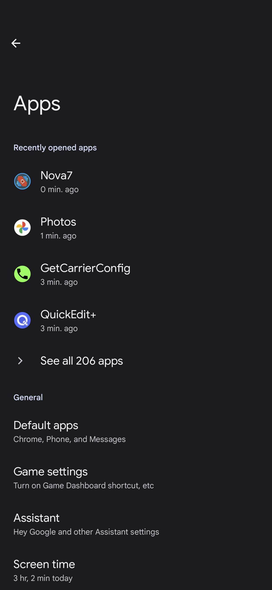
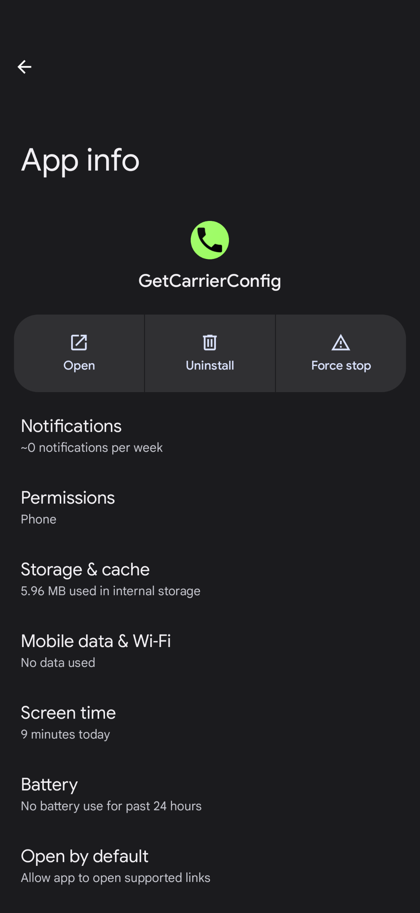
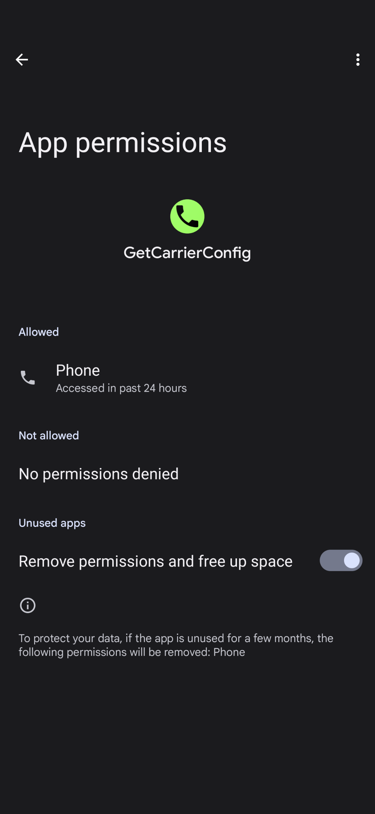
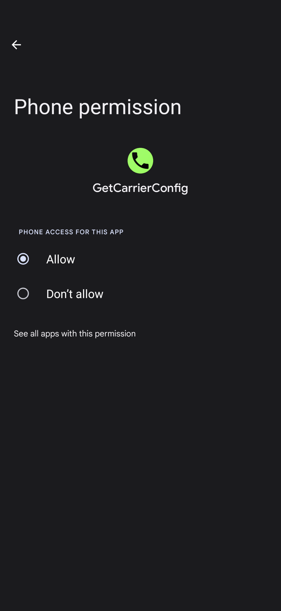

# GetCarrierConfig

A simple android app that pulls all of the readable carrier configuration from your provider

Requires `Phone` permissions to read the carrier configuration:

|  |  |
| --- | --- |
|  |  |

This is what the results look like:

```json
{
  "Device": "Google Pixel 6 Pro",
  "ENABLE_EAP_METHOD_PREFIX_BOOL": false,
  "IMSI_KEY_AVAILABILITY_INT": 0,
  "KEY_5G_NR_SSRSRP_THRESHOLDS_INT_ARRAY": [-110, -90, -80, -65],
  "KEY_5G_NR_SSRSRQ_THRESHOLDS_INT_ARRAY": [-31, -19, -7, 6],
  "KEY_5G_NR_SSSINR_THRESHOLDS_INT_ARRAY": [-5, 5, 15, 30],
  "KEY_ADDITIONAL_CALL_SETTING_BOOL": true,
  "KEY_ALLOW_ADDING_APNS_BOOL": true,
  "KEY_ALLOW_ADD_CALL_DURING_VIDEO_CALL_BOOL": true,
  "KEY_ALLOW_EMERGENCY_NUMBERS_IN_CALL_LOG_BOOL": false,
  "KEY_ALLOW_EMERGENCY_VIDEO_CALLS_BOOL": false,
  "KEY_ALLOW_HOLD_CALL_DURING_EMERGENCY_BOOL": true,
  "KEY_ALLOW_HOLD_VIDEO_CALL_BOOL": true,
  "KEY_ALLOW_LOCAL_DTMF_TONES_BOOL": true,
  "KEY_ALLOW_MERGE_WIFI_CALLS_WHEN_VOWIFI_OFF_BOOL": true,
  "KEY_ALLOW_NON_EMERGENCY_CALLS_IN_ECM_BOOL": true,
  "KEY_ALLOW_VIDEO_CALLING_FALLBACK_BOOL": true,
  "KEY_ALWAYS_SHOW_DATA_RAT_ICON_BOOL": false,
  "KEY_ALWAYS_SHOW_EMERGENCY_ALERT_ONOFF_BOOL": false,
  "KEY_ALWAYS_SHOW_PRIMARY_SIGNAL_BAR_IN_OPPORTUNISTIC_NETWORK_BOOLEAN": false,
  "KEY_APN_EXPAND_BOOL": true,
  "KEY_AUTO_RETRY_ENABLED_BOOL": false,
  "KEY_CALL_BARRING_DEFAULT_SERVICE_CLASS_INT": 1,
  "KEY_CALL_BARRING_SUPPORTS_DEACTIVATE_ALL_BOOL": true,
  "KEY_CALL_BARRING_SUPPORTS_PASSWORD_CHANGE_BOOL": true,
  "KEY_CALL_BARRING_VISIBILITY_BOOL": false,
  "KEY_CALL_COMPOSER_PICTURE_SERVER_URL_STRING": "",
  "KEY_CARRIER_ALLOW_DEFLECT_IMS_CALL_BOOL": false,
  "KEY_CARRIER_ALLOW_TURNOFF_IMS_BOOL": true,
  "KEY_CARRIER_APP_REQUIRED_DURING_SIM_SETUP_BOOL": false,
  "KEY_CARRIER_CALL_SCREENING_APP_STRING": "",
  "KEY_CARRIER_CERTIFICATE_STRING_ARRAY": [],
  "KEY_CARRIER_CONFIG_APPLIED_BOOL": false,
  "KEY_CARRIER_CONFIG_VERSION_STRING": "",
  "KEY_CARRIER_CROSS_SIM_IMS_AVAILABLE_BOOL": false,
  "KEY_CARRIER_DEFAULT_ACTIONS_ON_DEFAULT_NETWORK_AVAILABLE": ["false: 7", "true: 8"],
  "KEY_CARRIER_DEFAULT_ACTIONS_ON_REDIRECTION_STRING_ARRAY": ["9, 4, 1"],
  "KEY_CARRIER_DEFAULT_ACTIONS_ON_RESET": ["6, 8"],
  "KEY_CARRIER_DEFAULT_WFC_IMS_ENABLED_BOOL": false,
  "KEY_CARRIER_DEFAULT_WFC_IMS_MODE_INT": 2,
  "KEY_CARRIER_DEFAULT_WFC_IMS_ROAMING_MODE_INT": 2,
  "KEY_CARRIER_FORCE_DISABLE_ETWS_CMAS_TEST_BOOL": false,
  "KEY_CARRIER_IMS_GBA_REQUIRED_BOOL": false,
  "KEY_CARRIER_INSTANT_LETTERING_AVAILABLE_BOOL": false,
  "KEY_CARRIER_INSTANT_LETTERING_ENCODING_STRING": "",
  "KEY_CARRIER_INSTANT_LETTERING_ESCAPED_CHARS_STRING": "",
  "KEY_CARRIER_INSTANT_LETTERING_INVALID_CHARS_STRING": "",
  "KEY_CARRIER_INSTANT_LETTERING_LENGTH_LIMIT_INT": 64,
  "KEY_CARRIER_NAME_OVERRIDE_BOOL": false,
  "KEY_CARRIER_NAME_STRING": "",
  "KEY_CARRIER_NR_AVAILABILITIES_INT_ARRAY": [1, 2],
  "KEY_CARRIER_PROVISIONS_WIFI_MERGED_NETWORKS_BOOL": false,
  "KEY_CARRIER_RCS_PROVISIONING_REQUIRED_BOOL": true,
  "KEY_CARRIER_SETTINGS_ACTIVITY_COMPONENT_NAME_STRING": "",
  "KEY_CARRIER_SETTINGS_ENABLE_BOOL": false,
  "KEY_CARRIER_SETUP_APP_STRING": "",
  "KEY_CARRIER_SUPPORTS_SS_OVER_UT_BOOL": false,
  "KEY_CARRIER_USE_IMS_FIRST_FOR_EMERGENCY_BOOL": true,
  "KEY_CARRIER_USSD_METHOD_INT": 0,
  "KEY_CARRIER_UT_PROVISIONING_REQUIRED_BOOL": false,
  "KEY_CARRIER_VOLTE_AVAILABLE_BOOL": false,
  "KEY_CARRIER_VOLTE_OVERRIDE_WFC_PROVISIONING_BOOL": false,
  "KEY_CARRIER_VOLTE_PROVISIONED_BOOL": false,
  "KEY_CARRIER_VOLTE_PROVISIONING_REQUIRED_BOOL": false,
  "KEY_CARRIER_VOLTE_TTY_SUPPORTED_BOOL": true,
  "KEY_CARRIER_VT_AVAILABLE_BOOL": false,
  "KEY_CARRIER_VVM_PACKAGE_NAME_STRING": "",
  "KEY_CARRIER_WFC_IMS_AVAILABLE_BOOL": false,
  "KEY_CARRIER_WFC_SUPPORTS_WIFI_ONLY_BOOL": false,
  "KEY_CDMA_3WAYCALL_FLASH_DELAY_INT": 0,
  "KEY_CDMA_DTMF_TONE_DELAY_INT": 100,
  "KEY_CDMA_ROAMING_MODE_INT": -1,
  "KEY_CHECK_PRICING_WITH_CARRIER_FOR_DATA_ROAMING_BOOL": false,
  "KEY_CI_ACTION_ON_SYS_UPDATE_BOOL": false,
  "KEY_CI_ACTION_ON_SYS_UPDATE_EXTRA_STRING": "",
  "KEY_CI_ACTION_ON_SYS_UPDATE_EXTRA_VAL_STRING": "",
  "KEY_CI_ACTION_ON_SYS_UPDATE_INTENT_STRING": "",
  "KEY_CONFIG_TELEPHONY_USE_OWN_NUMBER_FOR_VOICEMAIL_BOOL": false,
  "KEY_CONFIG_WIFI_DISABLE_IN_ECBM": false,
  "KEY_CROSS_SIM_SPN_FORMAT_INT": 1,
  "KEY_CSP_ENABLED_BOOL": false,
  "KEY_DATA_LIMIT_NOTIFICATION_BOOL": true,
  "KEY_DATA_LIMIT_THRESHOLD_BYTES_LONG": -1,
  "KEY_DATA_RAPID_NOTIFICATION_BOOL": true,
  "KEY_DATA_SWITCH_VALIDATION_TIMEOUT_LONG": 2000,
  "KEY_DATA_WARNING_NOTIFICATION_BOOL": true,
  "KEY_DATA_WARNING_THRESHOLD_BYTES_LONG": -1,
  "KEY_DEFAULT_SIM_CALL_MANAGER_STRING": "",
  "KEY_DEFAULT_VM_NUMBER_ROAMING_AND_IMS_UNREGISTERED_STRING": "",
  "KEY_DEFAULT_VM_NUMBER_STRING": "",
  "KEY_DISABLE_CDMA_ACTIVATION_CODE_BOOL": false,
  "KEY_DISABLE_CHARGE_INDICATION_BOOL": false,
  "KEY_DISABLE_SUPPLEMENTARY_SERVICES_IN_AIRPLANE_MODE_BOOL": false,
  "KEY_DISCONNECT_CAUSE_PLAY_BUSYTONE_INT_ARRAY": [4],
  "KEY_DISPLAY_CALL_STRENGTH_INDICATOR_BOOL": true,
  "KEY_DISPLAY_HD_AUDIO_PROPERTY_BOOL": true,
  "KEY_DROP_VIDEO_CALL_WHEN_ANSWERING_AUDIO_CALL_BOOL": false,
  "KEY_DTMF_TYPE_ENABLED_BOOL": false,
  "KEY_DURATION_BLOCKING_DISABLED_AFTER_EMERGENCY_INT": 7200,
  "KEY_EDITABLE_ENHANCED_4G_LTE_BOOL": true,
  "KEY_EDITABLE_VOICEMAIL_NUMBER_BOOL": false,
  "KEY_EDITABLE_VOICEMAIL_NUMBER_SETTING_BOOL": true,
  "KEY_EDITABLE_WFC_MODE_BOOL": true,
  "KEY_EDITABLE_WFC_ROAMING_MODE_BOOL": false,
  "KEY_EMERGENCY_NOTIFICATION_DELAY_INT": -1,
  "KEY_EMERGENCY_NUMBER_PREFIX_STRING_ARRAY": [],
  "KEY_ENABLE_DIALER_KEY_VIBRATION_BOOL": true,
  "KEY_ENHANCED_4G_LTE_ON_BY_DEFAULT_BOOL": true,
  "KEY_ENHANCED_4G_LTE_TITLE_VARIANT_INT": 0,
  "KEY_FORCE_HOME_NETWORK_BOOL": false,
  "KEY_GBA_MODE_INT": 1,
  "KEY_GBA_UA_SECURITY_ORGANIZATION_INT": 1,
  "KEY_GBA_UA_SECURITY_PROTOCOL_INT": 65536,
  "KEY_GBA_UA_TLS_CIPHER_SUITE_INT": 0,
  "KEY_GSM_DTMF_TONE_DELAY_INT": 0,
  "KEY_HAS_IN_CALL_NOISE_SUPPRESSION_BOOL": false,
  "KEY_HIDE_CARRIER_NETWORK_SETTINGS_BOOL": false,
  "KEY_HIDE_ENABLE_2G": false,
  "KEY_HIDE_ENHANCED_4G_LTE_BOOL": false,
  "KEY_HIDE_IMS_APN_BOOL": false,
  "KEY_HIDE_LTE_PLUS_DATA_ICON_BOOL": true,
  "KEY_HIDE_PREFERRED_NETWORK_TYPE_BOOL": false,
  "KEY_HIDE_PRESET_APN_DETAILS_BOOL": false,
  "KEY_HIDE_SIM_LOCK_SETTINGS_BOOL": false,
  "KEY_HIDE_TTY_HCO_VCO_WITH_RTT_BOOL": false,
  "KEY_IGNORE_DATA_ENABLED_CHANGED_FOR_VIDEO_CALLS": true,
  "KEY_IGNORE_RTT_MODE_SETTING_BOOL": true,
  "KEY_IGNORE_SIM_NETWORK_LOCKED_EVENTS_BOOL": false,
  "KEY_IMS_CONFERENCE_SIZE_LIMIT_INT": 5,
  "KEY_IMS_DTMF_TONE_DELAY_INT": 0,
  "KEY_IS_IMS_CONFERENCE_SIZE_ENFORCED_BOOL": false,
  "KEY_LTE_ENABLED_BOOL": true,
  "KEY_LTE_RSRQ_THRESHOLDS_INT_ARRAY": [-20, -17, -14, -11],
  "KEY_LTE_RSSNR_THRESHOLDS_INT_ARRAY": [-3, 1, 5, 13],
  "KEY_MDN_IS_ADDITIONAL_VOICEMAIL_NUMBER_BOOL": false,
  "KEY_MMS_ALIAS_ENABLED_BOOL": false,
  "KEY_MMS_ALIAS_MAX_CHARS_INT": 48,
  "KEY_MMS_ALIAS_MIN_CHARS_INT": 2,
  "KEY_MMS_ALLOW_ATTACH_AUDIO_BOOL": true,
  "KEY_MMS_APPEND_TRANSACTION_ID_BOOL": false,
  "KEY_MMS_CLOSE_CONNECTION_BOOL": false,
  "KEY_MMS_EMAIL_GATEWAY_NUMBER_STRING": "",
  "KEY_MMS_GROUP_MMS_ENABLED_BOOL": true,
  "KEY_MMS_HTTP_PARAMS_STRING": "",
  "KEY_MMS_HTTP_SOCKET_TIMEOUT_INT": 60000,
  "KEY_MMS_MAX_IMAGE_HEIGHT_INT": 480,
  "KEY_MMS_MAX_IMAGE_WIDTH_INT": 640,
  "KEY_MMS_MAX_MESSAGE_SIZE_INT": 307200,
  "KEY_MMS_MESSAGE_TEXT_MAX_SIZE_INT": -1,
  "KEY_MMS_MMS_DELIVERY_REPORT_ENABLED_BOOL": false,
  "KEY_MMS_MMS_ENABLED_BOOL": true,
  "KEY_MMS_MMS_READ_REPORT_ENABLED_BOOL": false,
  "KEY_MMS_MULTIPART_SMS_ENABLED_BOOL": true,
  "KEY_MMS_NAI_SUFFIX_STRING": "",
  "KEY_MMS_NOTIFY_WAP_MMSC_ENABLED_BOOL": false,
  "KEY_MMS_RECIPIENT_LIMIT_INT": 2147483647,
  "KEY_MMS_SEND_MULTIPART_SMS_AS_SEPARATE_MESSAGES_BOOL": false,
  "KEY_MMS_SHOW_CELL_BROADCAST_APP_LINKS_BOOL": true,
  "KEY_MMS_SMS_DELIVERY_REPORT_ENABLED_BOOL": true,
  "KEY_MMS_SMS_TO_MMS_TEXT_LENGTH_THRESHOLD_INT": -1,
  "KEY_MMS_SMS_TO_MMS_TEXT_THRESHOLD_INT": -1,
  "KEY_MMS_SUBJECT_MAX_LENGTH_INT": 40,
  "KEY_MMS_SUPPORT_HTTP_CHARSET_HEADER_BOOL": false,
  "KEY_MMS_SUPPORT_MMS_CONTENT_DISPOSITION_BOOL": true,
  "KEY_MMS_UA_PROF_TAG_NAME_STRING": "x-wap-profile",
  "KEY_MMS_UA_PROF_URL_STRING": "",
  "KEY_MMS_USER_AGENT_STRING": "",
  "KEY_MONTHLY_DATA_CYCLE_DAY_INT": -1,
  "KEY_ONLY_AUTO_SELECT_IN_HOME_NETWORK_BOOL": false,
  "KEY_ONLY_SINGLE_DC_ALLOWED_INT_ARRAY": [4, 5, 6, 7, 8, 12],
  "KEY_OPERATOR_SELECTION_EXPAND_BOOL": true,
  "KEY_OPPORTUNISTIC_NETWORK_BACKOFF_TIME_LONG": 10000,
  "KEY_OPPORTUNISTIC_NETWORK_DATA_SWITCH_EXIT_HYSTERESIS_TIME_LONG": 3000,
  "KEY_OPPORTUNISTIC_NETWORK_DATA_SWITCH_HYSTERESIS_TIME_LONG": 10000,
  "KEY_OPPORTUNISTIC_NETWORK_ENTRY_OR_EXIT_HYSTERESIS_TIME_LONG": 10000,
  "KEY_OPPORTUNISTIC_NETWORK_ENTRY_THRESHOLD_BANDWIDTH_INT": 1024,
  "KEY_OPPORTUNISTIC_NETWORK_ENTRY_THRESHOLD_RSRP_INT": -108,
  "KEY_OPPORTUNISTIC_NETWORK_ENTRY_THRESHOLD_RSSNR_INT": 45,
  "KEY_OPPORTUNISTIC_NETWORK_EXIT_THRESHOLD_RSRP_INT": -118,
  "KEY_OPPORTUNISTIC_NETWORK_EXIT_THRESHOLD_RSSNR_INT": 10,
  "KEY_OPPORTUNISTIC_NETWORK_MAX_BACKOFF_TIME_LONG": 60000,
  "KEY_OPPORTUNISTIC_NETWORK_PING_PONG_TIME_LONG": 60000,
  "KEY_PING_TEST_BEFORE_DATA_SWITCH_BOOL": true,
  "KEY_PREFER_2G_BOOL": true,
  "KEY_PREVENT_CLIR_ACTIVATION_AND_DEACTIVATION_CODE_BOOL": false,
  "KEY_RADIO_RESTART_FAILURE_CAUSES_INT_ARRAY": [],
  "KEY_RCS_CONFIG_SERVER_URL_STRING": "",
  "KEY_READ_ONLY_APN_TYPES_STRING_ARRAY": ["dun"],
  "KEY_REQUIRE_ENTITLEMENT_CHECKS_BOOL": true,
  "KEY_RESTART_RADIO_ON_PDP_FAIL_REGULAR_DEACTIVATION_BOOL": false,
  "KEY_RTT_SUPPORTED_BOOL": false,
  "KEY_RTT_SUPPORTED_WHILE_ROAMING_BOOL": false,
  "KEY_RTT_UPGRADE_SUPPORTED_FOR_DOWNGRADED_VT_CALL_BOOL": true,
  "KEY_SHOW_4G_FOR_3G_DATA_ICON_BOOL": false,
  "KEY_SHOW_4G_FOR_LTE_DATA_ICON_BOOL": false,
  "KEY_SHOW_APN_SETTING_CDMA_BOOL": false,
  "KEY_SHOW_BLOCKING_PAY_PHONE_OPTION_BOOL": false,
  "KEY_SHOW_CALL_BLOCKING_DISABLED_NOTIFICATION_ALWAYS_BOOL": false,
  "KEY_SHOW_CDMA_CHOICES_BOOL": false,
  "KEY_SHOW_FORWARDED_NUMBER_BOOL": false,
  "KEY_SHOW_ICCID_IN_SIM_STATUS_BOOL": false,
  "KEY_SHOW_IMS_REGISTRATION_STATUS_BOOL": false,
  "KEY_SHOW_ONSCREEN_DIAL_BUTTON_BOOL": true,
  "KEY_SHOW_SIGNAL_STRENGTH_IN_SIM_STATUS_BOOL": true,
  "KEY_SHOW_VIDEO_CALL_CHARGES_ALERT_DIALOG_BOOL": false,
  "KEY_SHOW_WFC_LOCATION_PRIVACY_POLICY_BOOL": false,
  "KEY_SIMPLIFIED_NETWORK_SETTINGS_BOOL": false,
  "KEY_SIM_NETWORK_UNLOCK_ALLOW_DISMISS_BOOL": true,
  "KEY_SMS_REQUIRES_DESTINATION_NUMBER_CONVERSION_BOOL": false,
  "KEY_SUPPORTS_CALL_COMPOSER_BOOL": false,
  "KEY_SUPPORTS_DEVICE_TO_DEVICE_COMMUNICATION_USING_DTMF_BOOL": false,
  "KEY_SUPPORTS_DEVICE_TO_DEVICE_COMMUNICATION_USING_RTP_BOOL": false,
  "KEY_SUPPORTS_SDP_NEGOTIATION_OF_D2D_RTP_HEADER_EXTENSIONS_BOOL": false,
  "KEY_SUPPORT_3GPP_CALL_FORWARDING_WHILE_ROAMING_BOOL": true,
  "KEY_SUPPORT_ADD_CONFERENCE_PARTICIPANTS_BOOL": false,
  "KEY_SUPPORT_ADHOC_CONFERENCE_CALLS_BOOL": false,
  "KEY_SUPPORT_CDMA_1X_VOICE_CALLS_BOOL": true,
  "KEY_SUPPORT_CLIR_NETWORK_DEFAULT_BOOL": true,
  "KEY_SUPPORT_CONFERENCE_CALL_BOOL": true,
  "KEY_SUPPORT_EMERGENCY_SMS_OVER_IMS_BOOL": false,
  "KEY_SUPPORT_ENHANCED_CALL_BLOCKING_BOOL": true,
  "KEY_SUPPORT_IMS_CONFERENCE_EVENT_PACKAGE_BOOL": true,
  "KEY_SUPPORT_PAUSE_IMS_VIDEO_CALLS_BOOL": false,
  "KEY_SUPPORT_SWAP_AFTER_MERGE_BOOL": true,
  "KEY_SUPPORT_TDSCDMA_BOOL": false,
  "KEY_SWITCH_DATA_TO_PRIMARY_IF_PRIMARY_IS_OOS_BOOL": true,
  "KEY_TREAT_DOWNGRADED_VIDEO_CALLS_AS_VIDEO_CALLS_BOOL": false,
  "KEY_TTY_SUPPORTED_BOOL": true,
  "KEY_USE_ACS_FOR_RCS_BOOL": false,
  "KEY_USE_HFA_FOR_PROVISIONING_BOOL": false,
  "KEY_USE_IP_FOR_CALLING_INDICATOR_BOOL": false,
  "KEY_USE_OTASP_FOR_PROVISIONING_BOOL": false,
  "KEY_USE_RCS_PRESENCE_BOOL": false,
  "KEY_USE_RCS_SIP_OPTIONS_BOOL": false,
  "KEY_USE_WFC_HOME_NETWORK_MODE_IN_ROAMING_NETWORK_BOOL": false,
  "KEY_VOICEMAIL_NOTIFICATION_PERSISTENT_BOOL": false,
  "KEY_VOICE_PRIVACY_DISABLE_UI_BOOL": false,
  "KEY_VOLTE_REPLACEMENT_RAT_INT": 0,
  "KEY_VT_UPGRADE_SUPPORTED_FOR_DOWNGRADED_RTT_CALL_BOOL": true,
  "KEY_VVM_CELLULAR_DATA_REQUIRED_BOOL": false,
  "KEY_VVM_CLIENT_PREFIX_STRING": "//VVM",
  "KEY_VVM_DESTINATION_NUMBER_STRING": "",
  "KEY_VVM_LEGACY_MODE_ENABLED_BOOL": false,
  "KEY_VVM_PORT_NUMBER_INT": 0,
  "KEY_VVM_PREFETCH_BOOL": true,
  "KEY_VVM_SSL_ENABLED_BOOL": false,
  "KEY_VVM_TYPE_STRING": "",
  "KEY_WFC_EMERGENCY_ADDRESS_CARRIER_APP_STRING": "",
  "KEY_WORLD_MODE_ENABLED_BOOL": false,
  "KEY_WORLD_PHONE_BOOL": false,
  "KEY_AVOID_5GHZ_SOFTAP_FOR_LAA_BOOL": false,
  "KEY_AVOID_5GHZ_WIFI_DIRECT_FOR_LAA_BOOL": false,
  "KEY_HOTSPOT_MAX_CLIENT_COUNT": 0,
  "KEY_SUGGESTION_SSID_LIST_WITH_MAC_RANDOMIZATION_DISABLED": [],
  "KEY_ADD_KE_TO_CHILD_SESSION_REKEY_BOOL": false,
  "KEY_CHILD_SA_REKEY_HARD_TIMER_SEC_INT": 7200,
  "KEY_CHILD_SA_REKEY_SOFT_TIMER_SEC_INT": 3600,
  "KEY_CHILD_SESSION_AES_CBC_KEY_SIZE_INT_ARRAY": [128, 192, 256],
  "KEY_CHILD_SESSION_AES_CTR_KEY_SIZE_INT_ARRAY": [128, 192, 256],
  "KEY_DIFFIE_HELLMAN_GROUPS_INT_ARRAY": [2, 5, 14],
  "KEY_DPD_TIMER_SEC_INT": 120,
  "KEY_EPDG_ADDRESS_PRIORITY_INT_ARRAY": [1, 0],
  "KEY_EPDG_AUTHENTICATION_METHOD_INT": 0,
  "KEY_EPDG_PCO_ID_IPV4_INT": 0,
  "KEY_EPDG_PCO_ID_IPV6_INT": 0,
  "KEY_EPDG_STATIC_ADDRESS_ROAMING_STRING": "",
  "KEY_EPDG_STATIC_ADDRESS_STRING": "",
  "KEY_IKE_LOCAL_ID_TYPE_INT": 3,
  "KEY_IKE_REKEY_HARD_TIMER_SEC_INT": 14400,
  "KEY_IKE_REKEY_SOFT_TIMER_SEC_INT": 7200,
  "KEY_IKE_REMOTE_ID_TYPE_INT": 2,
  "KEY_IKE_SESSION_AES_CBC_KEY_SIZE_INT_ARRAY": [128, 192, 256],
  "KEY_IKE_SESSION_AES_CTR_KEY_SIZE_INT_ARRAY": [128, 192, 256],
  "KEY_MAX_RETRIES_INT": 3,
  "KEY_MCC_MNCS_STRING_ARRAY": [],
  "KEY_NATT_KEEP_ALIVE_TIMER_SEC_INT": 20,
  "KEY_RETRANSMIT_TIMER_MSEC_INT_ARRAY": [500, 1000, 2000, 4000, 8000],
  "KEY_SUPPORTED_CHILD_SESSION_ENCRYPTION_ALGORITHMS_INT_ARRAY": [12],
  "KEY_SUPPORTED_IKE_SESSION_ENCRYPTION_ALGORITHMS_INT_ARRAY": [12],
  "KEY_SUPPORTED_INTEGRITY_ALGORITHMS_INT_ARRAY": [5, 2, 12, 13, 14],
  "KEY_SUPPORTED_PRF_ALGORITHMS_INT_ARRAY": [2, 4, 5, 6, 7],
  "KEY_ENABLE_PRESENCE_CAPABILITY_EXCHANGE_BOOL": false,
  "KEY_ENABLE_PRESENCE_GROUP_SUBSCRIBE_BOOL": false,
  "KEY_ENABLE_PRESENCE_PUBLISH_BOOL": false,
  "KEY_IMS_SINGLE_REGISTRATION_REQUIRED_BOOL": false,
  "KEY_NON_RCS_CAPABILITIES_CACHE_EXPIRATION_SEC_INT": 2592000,
  "KEY_RCS_BULK_CAPABILITY_EXCHANGE_BOOL": false,
  "KEY_RCS_FEATURE_TAG_ALLOWED_STRING_ARRAY": ["+g.3gpp.icsi-ref=\"urn%3Aurn-7%3A3gpp-service.ims.icsi.oma.cpm.msg\"", "+g.3gpp.icsi-ref=\"urn%3Aurn-7%3A3gpp-service.ims.icsi.oma.cpm.largemsg\"", "+g.3gpp.icsi-ref=\"urn%3Aurn-7%3A3gpp-service.ims.icsi.oma.cpm.deferred\"", "+g.gsma.rcs.cpm.pager-large", "+g.3gpp.icsi-ref=\"urn%3Aurn-7%3A3gpp-service.ims.icsi.oma.cpm.session\"", "+g.3gpp.icsi-ref=\"urn%3Aurn-7%3A3gpp-service.ims.icsi.oma.cpm.filetransfer\"", "+g.3gpp.iari-ref=\"urn%3Aurn-7%3A3gpp-application.ims.iari.rcs.fthttp\"", "+g.3gpp.iari-ref=\"urn%3Aurn-7%3A3gpp-application.ims.iari.rcs.ftsms\"", "+g.3gpp.iari-ref=\"urn%3Aurn-7%3A3gpp-service.ims.icsi.gsma.callcomposer\"", "+g.gsma.callcomposer", "+g.3gpp.icsi-ref=\"urn%3Aurn-7%3A3gpp-service.ims.icsi.gsma.callunanswered\"", "+g.3gpp.icsi-ref=\"urn%3Aurn-7%3A3gpp-service.ims.icsi.gsma.sharedmap\"", "+g.3gpp.icsi-ref=\"urn%3Aurn-7%3A3gpp-service.ims.icsi.gsma.sharedsketch\"", "+g.3gpp.iari-ref=\"urn%3Aurn-7%3A3gpp-application.ims.iari.rcs.geopush\"", "+g.3gpp.iari-ref=\"urn%3Aurn-7%3A3gpp-application.ims.iari.rcs.geosms\"", "+g.3gpp.iari-ref=\"urn%3Aurn-7%3A3gpp-application.ims.iari.rcs.chatbot\"", "+g.3gpp.iari-ref=\"urn%3Aurn-7%3A3gpp-application.ims.iari.rcs.chatbot.sa\"", "+g.gsma.rcs.botversion=\"#=1,#=2\"", "+g.gsma.rcs.cpimext"],
  "KEY_WIFI_OFF_DEFERRING_TIME_MILLIS_INT": 4000,
  "KEY_PERSIST_LPP_MODE_BOOL": true,
  "KEY_SETTINGS_DEFAULT_PROTOCOL_STRING": "",
  "KEY_SETTINGS_DEFAULT_ROAMING_PROTOCOL_STRING": ""
}
```